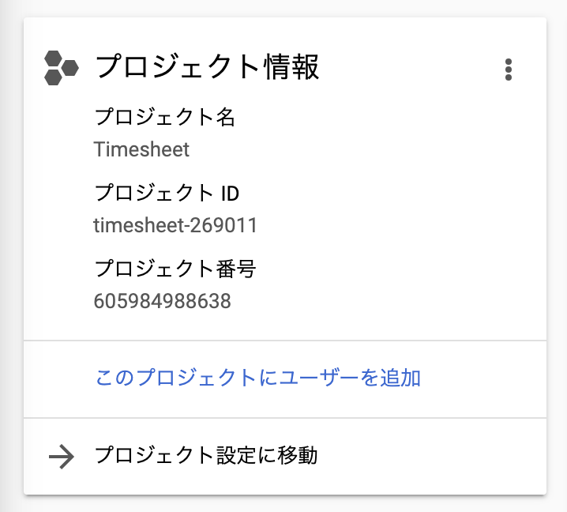
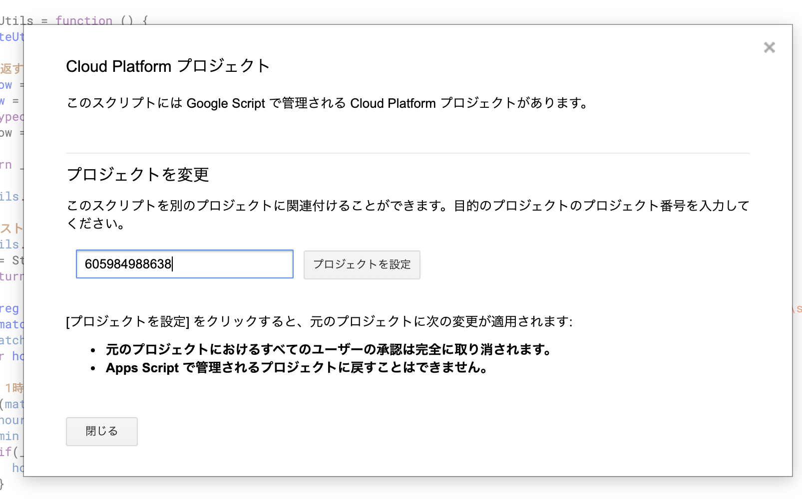
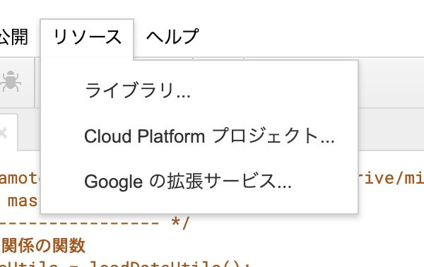
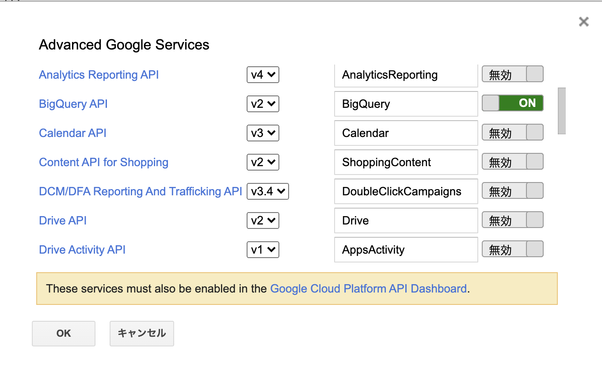
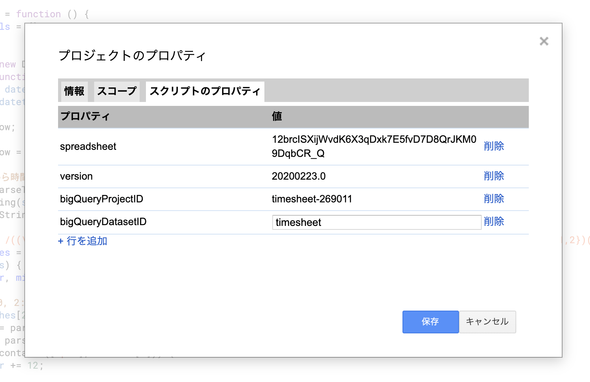
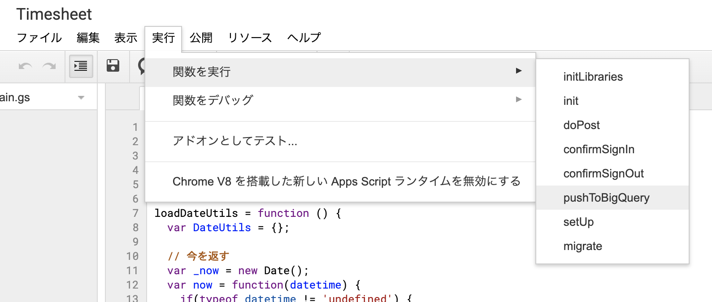

# How to build a development enviromnent

## Install requirements

```
npm install
```

## Setup gas-config

```
% ./node_modules/gas-manager/bin/gas init
===================
Start gas-manager init
===================

This utility is will walk you through creating a gas-manager's config file.
Press ^C at any time to quit.

Do you have client_id & client_secret for Google OAuth2? [yes/no] 
```

By following the instructions. It will create a file named `gas-config.json`. Please locate it on the project root.

You don't need to create project setting. Please answer `no` to below question.

```
Do you want to creating Project settings?  [yes/no] no
```

## Create Google Apps Script

Go to [Google Apps Script](https://script.google.com/home) and create new script and save as your favorite name.

If your script file name in the left pane is `コード.gs`, please change it to `main.gs`.

Then copy the file's ID from the URL and close the editor.
https://script.google.com/a/georepublic.de/d/[FILE_ID]/edit?splash=yes


Then, create a development project config from `gas-project.json`

```
cp gas-project.json gas-project-dev.json
```

Replace `fileId` field of `gas-project-dev.json` with the `FILE_ID` value.

## Deploy latest script

Run below command

```
% make dev
```

It will deploy new Google Apps Script to the App script.

## Create timesheet

Please open the updated script and publish it as a web API.
You can publish it from the menu > Publish > Deploy as Web App.

Access permission must be `Anyone, even anonymous`.


Then, copy `Current web app URL`. 

After that, you have to run `setUp` function once. It will create a Google Spreadsheed called `Slack Timesheet`


## Set up Slack

Go to Slack and add new integrations. (If you don't have a parmission, please ask.)

### Outgoing WebHooks

1. Select your test channel 
2. Paste `Current web app URL` from the Apps Script into URL(s) field.

### Incoming WebHooks

1. Select your test channel
2. Copy `Webhook URL`
3. Change your bot name
4. Paste the URL to `Slack Incoming URL` cell on the `Slack Timesheet`.
5. Add your bot name to the `無視するユーザ`.


### Test

Please say `hi` on your test channel. The bot will create new record on the timesheet and reploy something.

That's All! Pull Requests are very welcome!

You can find additional inormation from [Original Repos](https://github.com/masuidrive/miyamoto)


## Update script

When you update the Google Apps Script, you have to create new version for enabling the modification for the API.

1. Run `make dev` and upload the new main.gs.
2. Open your Google Apps script
3. Make a new version from `menu -> manage versions -> save new version`
4. Publish new version from `menu -> Publish -> Deploy as web app` and select the latest version.

## Set up BigQuery tables

Goto https://console.cloud.google.com/ and check if your Timesheet project is already exsisting.
If no, please create a new project.
Then copy project ID from the dashboard.



Open your Timesheet script, then set the project ID to the window from manu: select Resources -> Cloud Platform Projct



Go back to the GCP project page and enable BigQuery API if it is not enabled.


From GAS page, add BigQuery library.





Create new project and dataset from BigQuery console and copy the projectID and datasetID.


Set projectID and datasetID from the Google Script property from File -> Project Property menu.



## Push data to BigQuery table.

Now you can push the data to the BigQuery.
(At the first time, you will be asked to allow a permission to access BigQuery)



By default, this script will be fired every day 5 am.